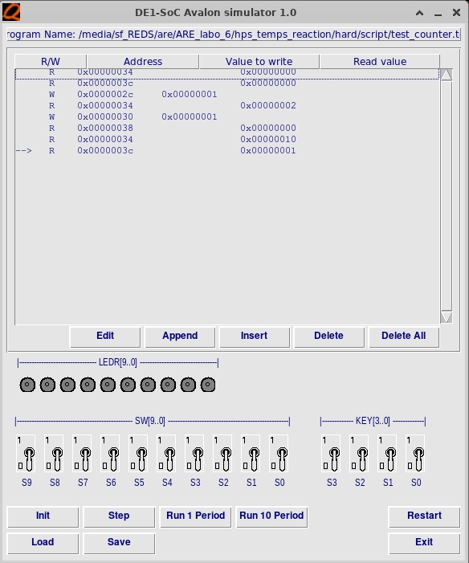

# Laboratoire 06 - Mesure du temps de réaction <!-- omit from toc -->

## Etudiants

- Rodrigo Lopez Dos Santos
- Urs Behrmann

# Table des matières

- [Table des matières](#table-des-matières)
- [Introduction](#introduction)
- [Analyse](#analyse)
  - [Plan d’adressage](#plan-dadressage)
  - [Emetteur série asynchrone](#emetteur-série-asynchrone)
- [Implémentation](#implémentation)
- [Tests](#tests)
  - [Simulation](#simulation)
    - [IOs](#ios)
    - [Compteurs](#compteurs)
    - [Interruptions](#interruptions)
    - [Test serial transmission to max10](#test-serial-transmission-to-max10)
- [Conclusion](#conclusion)

# Introduction

# Analyse

## Plan d’adressage

| Address (offset) | Read                      | Write                  |
| ---------------- | ------------------------- | ---------------------- |
| 0x00             | [31..0] Interface user ID | reserved               |
| 0x04             | [31..4] "0..0"            | reserved               |
|                  | [3..0] buttons            |                        |
| 0x08             | [31..10] "0..0"           | reserved               |
|                  | [9..0] switches           |                        |
| 0x0C             | [31..10] "0..0"           | [31..10] reserved      |
|                  | [9..0] leds               | [9..0] leds            |
| 0x10             | [31..28] reserved         | [31..28] reserved      |
|                  | [27..21] hex3             | [27..21] hex3          |
|                  | [20..14] hex2             | [20..14] hex2          |
|                  | [13..7] hex1              | [13..7] hex1           |
|                  | [6..0] hex0               | [6..0] hex0            |
| 0x14             | [31..2] reserved          | [31..1] reserved       |
|                  | [1] interrupt             | [0] clear interrupt    |
|                  | [0] statut flanc montant  |                        |
| 0x18             | [31..1] reserved          | [31..1] reserved       |
|                  | [0] interrupt mask        | [0] set interrupt mask |
| 0x1C             | [31..1] reserved          | [31..0] reserved       |
|                  | [0] Max10 status          |                        |
| 0x20             | [31..0] reserved          | [31..0] reserved       |
|                  | [0] Max10 busy            |                        |
| 0x24             | [31..0] reserved          | [31..1] reserved       |
|                  |                           | [0] Max10 CS           |
| 0x28             | [31..0] reserved          | [31..0] reserved       |
|                  |                           | [0] Max10 data         |
| 0x2C             | [31..0] reserved          | [31..0] reserved       |
|                  |                           | [0] Counter start      |
| 0x30             | [31..0] reserved          | [31..0] reserved       |
|                  |                           | [0] Counter stop       |
| 0x34             | [31..0] reserved          | [31..0] reserved       |
|                  | [0] Counter delta         |                        |
| 0x38             | [31..0] reserved          | [31..0] reserved       |
|                  | [0] Counter error         |                        |
| 0x3C             | [31..0] reserved          | [31..0] reserved       |
|                  | [0] Counter cycle count   |                        |

## Emetteur série asynchrone

Pour l'émetteur série asynchrone, nous avons dû utilsé une baudrate de 9600. Mais la vitesse de l'horloge étant de 50 MHz, nous avons dû utiliser un timer pour diviser cette fréquence. Nous avons donc utilisé un timer qui compte jusqu'à 5208 pour obtenir une fréquence de environ 9600 Hz.

# Interface (VHDL)
## Schéma

---
### Composants
***counter_cycle***
Implémente un compteur cyclique utilisé pour mesurer des périodes définies, probablement à 20 ns de précision.

***counter_reaction.vhd***
Spécifique à la mesure du temps de réaction, il démarre et arrête le comptage en fonction des signaux d’entrée.

***counter_setpoint.vhd***
Permet de définir un seuil ou un point d’arrêt pour le comptage.

***serial_async_transmitter.vhd***
Implémente l’émetteur série asynchrone de 20 bits, sans parité, pour communiquer avec la carte Max10_leds.
Prend en charge le protocole spécifié (bit de départ, 20 bits de données, bit d’arrêt).

---
### Processus
***write_outputs***  
Gère les sorties des LEDs et des afficheurs 7 segments (HEX) en écrivant les données reçues depuis le bus Avalon.

***read_address_decoder***  
Décode les adresses Avalon pour diriger les lectures vers les périphériques appropriés, comme les boutons et interrupteurs.

***write_interrupt***  
Permet de masquer, activer ou acquitter les interruptions générées par KEY0, en interagissant avec les registres d’interruption.

***read_interrupt_source***  
Renvoie l’état des interruptions et des détections de flanc pour une gestion correcte des signaux.

***sync_inputs***  
Synchronise les entrées des boutons et interrupteurs pour garantir leur stabilité face aux métastabilités.

***write_max10***  
Prend en charge la conversion des données pour les transmettre à la carte Max10_leds via l’émetteur série.

***write_cnt_spt***  
Permet de configurer le seuil du compteur `cnt_spt` et de démarrer ou arrêter son fonctionnement en fonction des besoins.

***read_data_to_bus***  
Lit les données des registres internes (par exemple, valeurs des compteurs ou état des périphériques) et les transmet via le bus Avalon pour qu'elles soient accessibles au processeur.

---
# Programme (C)
## fichiers & utilisation
### UART (uart.c / uart.h)
- Fournit des fonctions pour configurer et gérer la communication série (baudrate, envoi de messages, gestion FIFO).
- Utilisé pour afficher des messages dans un terminal distant via UART.

### Interruptions (exceptions.c / exceptions.h)
- Configure le contrôleur générique d’interruptions (GIC).
- Définit les vecteurs d’exceptions pour gérer des interruptions (notamment pour le bouton KEY0).
- Gère l'interruption principale avec la fonction fpga_ISR.

### 
- Avalon (avalon.h, avalon_functions.c / avalon_functions.h)
- Encapsule l’accès au bus Avalon pour interagir avec les registres des périphériques (LEDs, switches, afficheurs).
- Fournit des macros de lecture/écriture pour manipuler les données efficacement.

### Application principale (app.c / app.h)
- Implémente la logique du jeu en utilisant une machine à états :
  - Initialisation (APP_INIT).
  - Attente (APP_WAIT).
  - Début du jeu (APP_START_GAME).
  - Erreur (APP_ERROR).
- Gère les entrées (boutons, interrupteurs) et affiche les résultats sur l’UART et les LEDs.
- Implémente l'ISR de la FPGA (KEY0), ISR utilisé pour la gestion de fin de jeu lorsqu'une jeu est commencé (APP_START_GAME)

## Logique principale
L'objectif du programme est de mesurer le temps de réaction de l'utilisateur en utilisant les composants de la carte DE1-SoC et MAX10. Voici la logique étape par étape :

### Initialisation :
- Configure l’UART, le GIC, et les périphériques via Avalon.
- Désactive les interruptions jusqu'à ce que l'application soit prête.
- Affiche les instructions utilisateur sur l’UART.

### Machine à états :
- APP_INIT : Configure les LEDs, afficheurs, et active les interruptions.
- APP_WAIT : Surveille les entrées utilisateur (boutons, interrupteurs) pour déterminer l’état suivant.
- APP_START_GAME : Affiche le symbole de début et démarre le compteur.
- APP_INIT_GAME : Configure un temps aléatoire pour démarrer la mesure.
- APP_ERROR : Gère les erreurs (ex. : configuration invalide de la carte MAX10).

### Gestion des interruptions :
- Lorsqu'un utilisateur appuie sur KEY0, une interruption déclenche :
  - Le calcul du temps de réaction via un compteur.
  - L’affichage des résultats (UART, LEDs, HEX).
  - La mise à jour des statistiques (meilleur/pire temps, erreurs, essais).

### Affichage des résultats :
- Les afficheurs HEX montrent les données (dernier temps, meilleures performances, erreurs, essais) selon la configuration choisie via SW0 à SW3.
- L’UART fournit un résumé complet des performances.

---
# Tests
## Simulation (Interface)
### IOs
On a fait une première simulation pour vérifier les IOs. On a fait une suite de R/W sur les adresses de la mémoire. On a vérifié que les valeurs lues correspondaient aux valeurs écrites.

### Compteurs
On a fait une deuxième simulation pour vérifier le compteur. On a fait un test avec 0 périodes supplémentaires. On voit bien que le compteur s'incrémente de 2 avec chaque instruction. On a un total de 6 périodes. entre le début et la fin du comptage.

Avec 10 périodes supplémentaires, on voit qu'on a un total de 16 périodes entre le début et la fin du comptage.

### Interruptions
Pour les interruptions, on a fait un premier test pour vérifier que l'interruption se déclenche bien. On a changé la position du bouton 0 de 0 à 1. On voit bien que l'interruption se déclenche.

On peut bien voir qu'on n'a pas d'interruption à la première lecture du registre 0x14 et qu'on a une interruption à la deuxième lecture.

Dans la deuxième partie de la simulation, on a activé le masque d'interruption. On voit bien que l'interruption ne se déclenche pas, mais que le bit d'indication de flanc montant est à 1.

### Test serial transmission to max10
Pour tester la transmission série vers le max10, on a fait un test avec une valeur de 0xabaa et un chip select de 0x01. Cela nous donne une data de 0x01abaa ou bien 0b0001_1010_1011_1010_1010.

On a aussi changé la vitesse de la baudrate pour avoir une pulse tous les 4 cycles. 

## Visuel via UART (Programme)

# Conclusion
> Le projet a permis de développer une application fonctionnelle respectant les exigences du cahier des charges, malgré des défis rencontrés tout au long de sa réalisation. Voici une synthèse des principaux points :

## Points marquants et réussites
- Conformité au cahier des charges : Toutes les fonctionnalités spécifiées, comme la gestion des LEDs, les afficheurs 7 segments, la communication série avec la MAX10 et la mesure du temps de réaction, ont été implémentées et validées.
- Code C complet et fonctionnel : La logique de l'application est robuste et a permis de gérer les différents états du système tout en intégrant efficacement les interruptions, les entrées utilisateur et les affichages.
- Gestion des aléas : Un problème d'allumage aléatoire des LEDs de la MAX10 a été corrigé grâce à un "patch" introduisant une attente de 1 ms entre chaque envoi, garantissant ainsi un comportement stable.
- Approche modulaire : La séparation claire entre le VHDL et le C a facilité l'intégration et le dépannage des différentes parties.
## Défis rencontrés et axes d'amélioration
- Communication série initiale : Une première conception imprécise pour la communication série avec la MAX10 a entraîné des retards importants (2 à 3 semaines) en raison d'une phase de débogage prolongée. Cela a limité le temps disponible pour perfectionner le projet.
- Problèmes liés au VHDL : Certains comportements inattendus, comme l'interruption déclenchée au démarrage ou le problème d'allumage des LEDs, semblent liés à des lacunes dans notre conception VHDL. Une version non finalisée du fichier avl_user_interface_not_finished.vhdl est incluse, illustrant nos efforts pour améliorer cette partie, bien que non testée faute de temps.
- Pression temporelle : Les dernières semaines ont été marquées par un rythme intense, limitant nos capacités à itérer sur certaines solutions et à approfondir les tests.
## Bilan global
Malgré ces défis, nous sommes fiers de présenter une solution fonctionnelle. Bien qu'elle ne soit pas exempte de limitations, elle répond aux attentes principales du laboratoire et démontre notre capacité à surmonter des obstacles complexes dans un délai restreint. Ce projet nous a permis de renforcer nos compétences en conception embarquée, en gestion des interruptions, et en communication série.